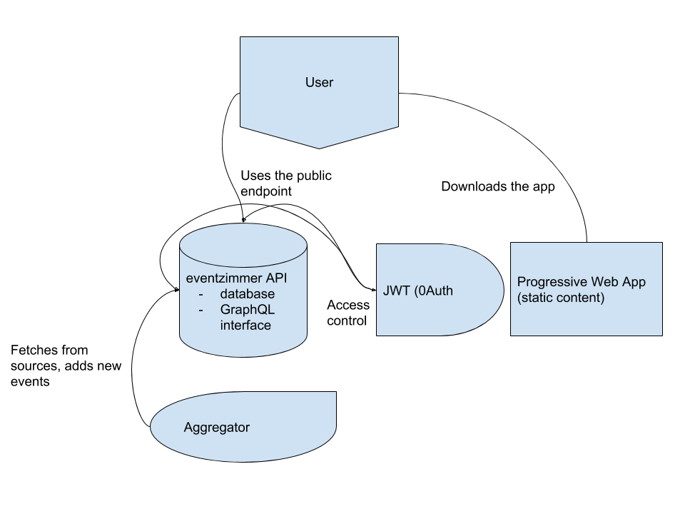

`@eventzimmer`
-------------

Welcome to the eventzimmmer main repository.

This repository is used for:

- tracking milestones
- issue management
- general discussion

There are several milestone files with defined goals.

## Current milestones

We use semantic versioning, starting off with the `1.0` release.
Here are in order the current milestones:

- [x] [1.0](MILESTONE-1.0.md)
- [ ] [1.1](MILESTONE-1.1.md)
- [ ] [1.2](MILESTONE-1.2.md)
- [ ] [1.3](MILESTONE-1.3.md)

## A note on contributing

Depending on what you would like to contribute, this may or may not be the place to go. Please check the [contribution guidelines](CONTRIBUTING.md).

## Eventzimmer architecture
Eventzimmer is composed of several parts:

- the API which contains database configuration as well as the public and private endpoints
- an aggregation service which is run as a client against the private endpoint
- a progressive web app which is hosted as static files and faces the user (both in web and on mobile)

This is illustrated in below image

